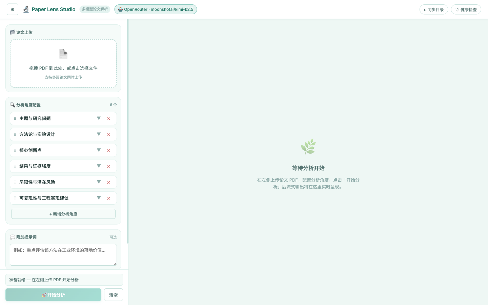
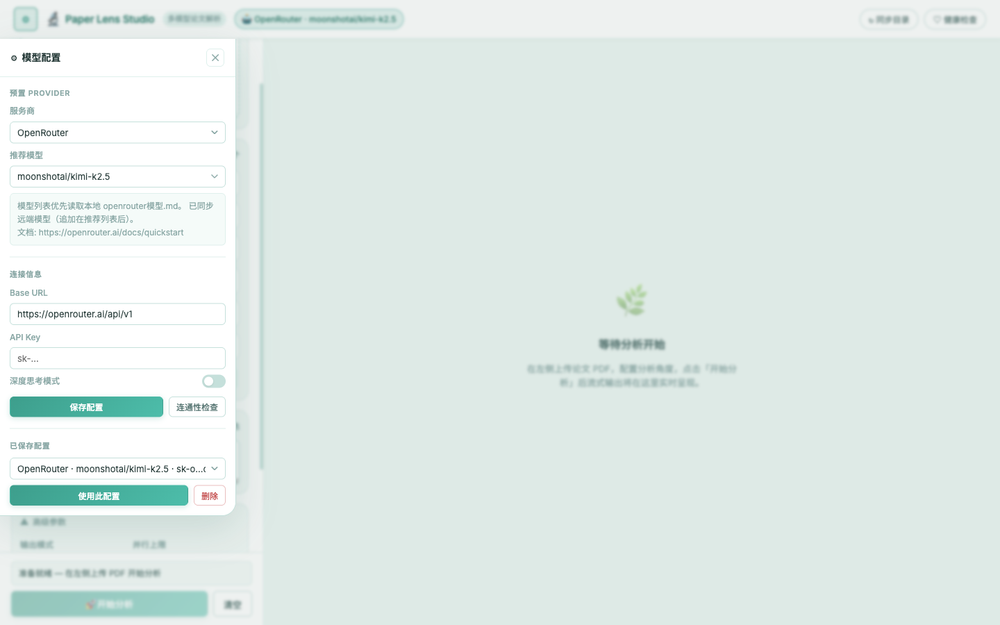
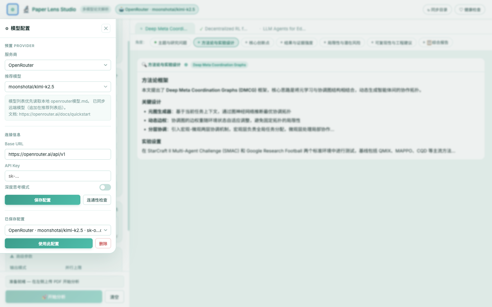

# Paper Lens Studio

一个面向论文解读的全栈应用，包含 React 现代化前端与 FastAPI 高性能后端：
- **React 18 前端**：小清新风格 UI，支持单篇 / 多篇论文并行流式分析，模型配置浮层
- **多模型支持**：使用 `api_key + base_url + model` 动态切换大模型服务商（OpenAI 协议）
- **多角度分析**：上传 PDF 后按多个可自定义角度分析，返回角度结果与最终融合报告
- **流式输出**：SSE 实时流式展示，支持多篇论文并行分析

## 📋 目录

- [界面预览](#界面预览)
- [功能特性](#功能特性)
- [快速开始](#快速开始)
- [项目结构](#项目结构)
- [API 文档](#api-文档)
- [配置说明](#配置说明)
- [部署指南](#部署指南)
- [开发指南](#开发指南)
- [常见问题](#常见问题)

## 🖼️ 界面预览

### 主界面

左侧为配置区域（上传 + 角度配置 + 参数），右侧为流式输出区域。



### 模型配置浮层

点击左上角 ⚙ 按钮，在浮层中选择服务商、填写 API Key，支持保存多套配置。



### 多篇论文并行分析

上传多篇论文后，右侧顶部出现论文 Tab 栏（含实时状态指示），每篇论文内部有角度 Tab 栏。



## ✨ 功能特性

### 前端特性
- ✅ **React 18 + Vite**：现代化 SPA，热重载开发体验
- ✅ **小清新设计**：薄荷绿配色、柔和阴影、圆角卡片风格
- ✅ **模型配置浮层**：左上角 ⚙ 弹出，支持多套配置保存与切换
- ✅ **多篇并行分析**：多论文同时流式输出，双层 Tab 导航（论文 Tab + 角度 Tab）
- ✅ **实时状态指示**：Tab 上显示分析进度（⟳ 分析中 / ✓ 完成 / ✕ 出错）
- ✅ **深度思考模式**：可展示 Reasoning 模型的思考过程
- ✅ **Markdown 渲染**：流式内容实时 Markdown 渲染，DOMPurify 安全净化

### 后端核心功能
- ✅ **多模型支持**：支持 OpenAI 兼容协议的任意模型服务商（OpenAI、OpenRouter、Groq、豆包、智谱等）
- ✅ **多角度分析**：可自定义分析角度，从多个维度深入解读论文
- ✅ **批量并行分析**：支持一次上传多篇论文并并发处理
- ✅ **流式输出**：SSE 实时流式输出分析结果
- ✅ **Provider 管理**：持久化存储模型配置，支持 CRUD 操作
- ✅ **目录同步**：自动同步 Provider 目录，支持定时和手动触发
- ✅ **健康检查**：提供完整的健康检查和验证工具

### 技术特点
- ⚛️ **React 18 + Vite 5**：现代化前端构建栈
- 🚀 **FastAPI**：高性能异步 Web 框架
- 📦 **Docker 支持**：一键部署，容器化运行
- 🔒 **环境变量管理**：安全的配置管理
- 📊 **SQLite 存储**：轻量级数据持久化
- 🌐 **CORS 支持**：跨域请求支持

### 商业版本
基于本功能我们开发了智能体版本，支持通过上传论文和对话撰写完整的综述性论文，支持构建属于自己的知识库助理，让agent管理你的知识。链接：https://ga.metaagenthub.com/

## 🚀 快速开始

### 环境要求

- Python 3.8+
- Node.js 18+（前端开发 / 构建）
- pip 或 conda
- （可选）Docker 和 Docker Compose

### 1. 克隆项目

```bash
git clone https://github.com/JNUZXF/read_paper_with_ai.git
cd read_paper_with_ai
```

### 2. 虚拟环境安装

```bash
# 创建虚拟环境
python3 -m venv .venv

# 激活虚拟环境
# macOS/Linux
source .venv/bin/activate
# Windows
.venv\Scripts\activate

# 升级 pip
python -m pip install --upgrade pip

# 安装依赖
python -m pip install -r requirements.txt
```

### 3. 配置环境变量

复制 `.env.example`（如果存在）或创建 `.env` 文件，配置必要的 API 密钥：

```bash
# OpenAI API 密钥
OPENAI_API_KEY=your_openai_api_key

# OpenRouter API 密钥（可选）
OPENROUTER_API_KEY=your_openrouter_api_key

# 其他模型服务商的 API 密钥...
```

**注意**：`.env` 文件包含敏感信息，已添加到 `.gitignore`，不会被提交到版本控制。

### 4. 启动服务

#### 方式一：本地开发模式（推荐）

**启动后端：**

```bash
# Terminal 1
python run_server.py
```

**启动前端（React 开发服务器，热重载）：**

```bash
# Terminal 2
cd frontend
npm install   # 首次执行
npm run dev   # 端口 43117
```

服务地址：
- 前端界面（开发）：`http://localhost:43117`
- API 文档：`http://localhost:43117/docs`（Swagger UI）

**构建生产版本（将前端编译进 `web/`，由后端直接提供服务）：**

```bash
cd frontend
npm run build   # 输出至 ../web/
```

构建后直接访问 `http://localhost:43117` 即可。

#### 方式二：Docker 部署

```bash
# docker命令
docker compose up -d --build
```

容器对外端口：`http://localhost:43117`

## 📁 项目结构

```
read_paper_with_ai/
├── app/                    # 后端核心代码（FastAPI）
│   ├── __init__.py
│   ├── main.py            # FastAPI 应用入口
│   ├── config.py          # 配置管理
│   ├── schemas.py         # Pydantic 数据模型
│   ├── analyzer.py        # 论文分析核心逻辑
│   ├── llm_client.py      # LLM 客户端封装
│   ├── prompts.py         # 提示词模板
│   ├── pdf_service.py     # PDF 处理服务
│   ├── provider_catalog.py # Provider 目录管理
│   ├── catalog_sync.py     # 目录同步逻辑
│   └── provider_store.py  # Provider 持久化存储
├── frontend/               # 前端源码（React 18 + Vite）
│   ├── index.html
│   ├── vite.config.js     # Vite 配置（构建输出至 web/，代理 API）
│   ├── package.json
│   └── src/
│       ├── main.jsx       # React 入口
│       ├── App.jsx        # 根组件：全局状态 + 流式逻辑
│       ├── styles.css     # 设计 Token + 全局样式
│       ├── components/
│       │   ├── Header.jsx
│       │   ├── SettingsDrawer.jsx
│       │   ├── LeftPanel.jsx
│       │   ├── RightPanel.jsx
│       │   ├── OutputArea.jsx
│       │   ├── UploadZone.jsx
│       │   └── AngleConfigList.jsx
│       └── utils/
│           ├── api.js     # fetch 封装
│           └── markdown.js # marked + DOMPurify 渲染
├── web/                    # 前端构建产物（由后端 StaticFiles 提供服务）
├── docs/                   # 文档与截图
│   ├── frontend.md        # 前端详细使用文档
│   └── screenshots/       # UI 截图
├── scripts/                # 工具脚本
│   ├── health_check.py    # 健康检查脚本
│   ├── docker_deploy.sh   # Docker 部署脚本
│   ├── docker_verify.sh   # Docker 验证脚本
│   └── docker_down.sh     # Docker 停止脚本
├── data/                   # 数据目录（SQLite 数据库等）
├── .env                    # 环境变量配置（不提交到 Git）
├── .gitignore
├── requirements.txt       # Python 依赖
├── Dockerfile
├── docker-compose.yml
├── run_server.py          # 后端启动脚本
└── README.md
```

## 📚 API 文档

### 1. 健康检查

检查服务是否正常运行。

**请求**
```http
GET /health
```

**响应**
```json
{
  "status": "ok",
  "timestamp": "2026-02-21T12:00:00"
}
```

### 2. 模型连通性检查

验证模型配置是否有效，能否正常调用。

**请求**
```http
POST /v1/models/validate
Content-Type: application/json

{
  "api_key": "sk-xxx",
  "base_url": "https://api.openai.com/v1",
  "model": "gpt-4o-mini"
}
```

**响应**
```json
{
  "valid": true,
  "model": "gpt-4o-mini",
  "provider": "openai"
}
```

### 3. 论文多角度分析

上传 PDF 文件并进行多角度分析。

**请求**
```http
POST /v1/papers/analyze
Content-Type: multipart/form-data

options_json: {
  "api_key": "sk-xxx",
  "base_url": "https://api.openai.com/v1",
  "model": "gpt-4o-mini",
  "paper_title": "可选标题",
  "angles": [
    "主题与研究问题",
    "方法论与实验设计",
    "核心创新点",
    "结果与证据强度",
    "局限性与潜在风险"
  ],
  "user_prompt": "重点分析是否适合在工业环境落地",
  "temperature": 0.2
}
file: <PDF文件>
```

**响应**
```json
{
  "angles": [
    {
      "angle": "主题与研究问题",
      "rounds": [
        {
          "content": "分析结果...",
          "timestamp": "2026-02-21T12:00:00"
        }
      ],
      "final": "最终分析结果..."
    }
  ],
  "final_report": "全角度融合结论..."
}
```

### 4. 流式分析接口

支持实时流式输出分析结果。

**请求**
```http
POST /v1/papers/analyze/stream
Content-Type: multipart/form-data

options_json: {
  "api_key": "sk-xxx",
  "base_url": "https://api.openai.com/v1",
  "model": "gpt-4o-mini",
  "angles": ["主题与研究问题", "方法论与实验设计"],
  "stream_mode": "sequential",  // 或 "parallel"
  "parallel_limit": 3
}
file: <PDF文件>
```

**响应**
```
data: {"type": "angle_start", "angle": "主题与研究问题"}
data: {"type": "chunk", "angle": "主题与研究问题", "content": "分析内容..."}
data: {"type": "angle_complete", "angle": "主题与研究问题"}
data: {"type": "final_report", "content": "最终报告..."}
```

**流式模式说明**：
- `sequential`：逐个角度流式输出
- `parallel`：并行角度流式输出（由 `parallel_limit` 控制并发上限）

### 4.1 批量并行分析接口

支持一次提交多篇 PDF，并并发完成分析。

**请求**
```http
POST /v1/papers/analyze/batch
Content-Type: multipart/form-data

options_json: {
  "provider_id": 1,
  "angles": ["主题与研究问题", "方法论与实验设计"],
  "parallel_limit": 3
}
files: <PDF文件1>
files: <PDF文件2>
...
```

**响应**
```json
{
  "total": 2,
  "succeeded": 2,
  "failed": 0,
  "items": [
    {
      "filename": "paper_a.pdf",
      "ok": true,
      "result": {
        "paper_title": "Paper A",
        "angles": [],
        "final_report": "..."
      }
    }
  ]
}
```

### 5. Provider 目录

获取预置的 Provider 配置和推荐模型。

**请求**
```http
GET /v1/catalog/providers
```

**响应**
```json
{
  "providers": [
    {
      "name": "OpenAI",
      "base_url": "https://api.openai.com/v1",
      "models": ["gpt-4o", "gpt-4o-mini", "gpt-3.5-turbo"]
    }
  ]
}
```

### 6. Provider 目录同步

**查看同步状态**
```http
GET /v1/catalog/sync/status
```

**手动触发同步**
```http
POST /v1/catalog/sync/trigger
```

### 7. Provider 配置管理

**列出所有 Provider**
```http
GET /v1/providers
```

**创建 Provider**
```http
POST /v1/providers
Content-Type: application/json

{
  "name": "My Provider",
  "base_url": "https://api.example.com/v1",
  "api_key": "sk-xxx",
  "default_model": "gpt-4o-mini"
}
```

**更新 Provider**
```http
PUT /v1/providers/{provider_id}
Content-Type: application/json

{
  "name": "Updated Name",
  "default_model": "gpt-4o"
}
```

**删除 Provider**
```http
DELETE /v1/providers/{provider_id}
```

**使用 Provider 验证模型**
```http
POST /v1/models/validate/provider/{provider_id}
Content-Type: application/json

{
  "model": "gpt-4o-mini"
}
```

## ⚙️ 配置说明

### 环境变量配置

在 `.env` 文件中配置以下变量：

#### 应用配置
```bash
# 应用名称
APP_NAME=Paper LLM Gateway

# 后端端口（默认 43117）
APP_PORT=43117

# 是否启用热重载（开发模式）
APP_RELOAD=false
```

#### 目录同步配置
```bash
# 是否启用目录同步
CATALOG_SYNC_ENABLED=true

# 启动时是否立即同步
CATALOG_SYNC_ON_STARTUP=true

# 同步间隔（秒，默认 6 小时）
CATALOG_SYNC_INTERVAL_SECONDS=21600

# 同步超时时间（秒）
CATALOG_SYNC_TIMEOUT_SECONDS=20
```

#### API 密钥配置
```bash
# OpenAI
OPENAI_API_KEY=your_key

# OpenRouter
OPENROUTER_API_KEY=your_key

# Groq
GROQ_API_KEY=your_key

# 豆包/火山引擎
DOUBAO_API_KEY=your_key
ARK_API_KEY=your_key

# 智谱
ZHIPU_API_KEY=your_key

# 其他服务商...
```

### 数据库配置

Provider 配置存储在 SQLite 数据库中：
- 位置：`data/providers.db`
- 自动创建：首次使用时自动初始化

## 🐳 部署指南

### Docker 部署

#### 1. 构建镜像

```bash
docker build -t paper-llm-gateway .
```

#### 2. 使用 Docker Compose

```bash
# 启动服务
docker-compose up -d

# 查看日志
docker-compose logs -f

# 停止服务
docker-compose down
```

#### 3. 使用部署脚本

```bash
# 部署（构建、启动、等待健康检查）
./scripts/docker_deploy.sh

# 验证功能
./scripts/docker_verify.sh

# 停止服务
./scripts/docker_down.sh
```

### 生产环境部署建议

1. **环境变量管理**：使用密钥管理服务（如 AWS Secrets Manager、HashiCorp Vault）
2. **反向代理**：使用 Nginx 或 Traefik 作为反向代理
3. **HTTPS**：配置 SSL/TLS 证书
4. **监控**：集成 Prometheus、Grafana 等监控工具
5. **日志**：配置集中式日志收集（如 ELK Stack）

## 💻 开发指南

### 前端开发

```bash
cd frontend

# 安装依赖
npm install

# 开发模式（热重载，端口 43118）
npm run dev

# 生产构建（输出至 web/，后端直接服务）
npm run build

# 预览生产构建
npm run preview
```

前端技术栈：React 18 + Vite 5 + marked + DOMPurify。详细说明参见 [docs/frontend.md](docs/frontend.md)。

### 后端代码结构

- **`app/main.py`**：FastAPI 应用主文件，定义所有路由
- **`app/analyzer.py`**：论文分析核心逻辑，处理多角度分析
- **`app/llm_client.py`**：LLM 客户端封装，支持 OpenAI 兼容协议
- **`app/provider_store.py`**：Provider 配置的 CRUD 操作
- **`app/catalog_sync.py`**：目录同步后台任务

### 添加新的分析角度

在调用 API 时，在 `angles` 数组中添加自定义角度：

```json
{
  "angles": [
    "主题与研究问题",
    "你的自定义角度"
  ]
}
```

### 扩展模型支持

项目支持所有 OpenAI 兼容协议的模型服务商。只需提供正确的 `base_url` 和 `api_key` 即可。

### 运行测试

```bash
# Mock 全链路测试（不依赖外部模型）
python scripts/health_check.py

# OpenRouter 真实链路测试
python scripts/health_check.py --live-openrouter --model google/gemini-2.5-flash
```

## 🔍 常见问题

### Q: 如何切换不同的模型服务商？

A: 在调用分析接口时，通过 `options_json` 中的 `api_key`、`base_url` 和 `model` 参数指定。也可以先创建 Provider 配置，然后使用 Provider ID 调用。

### Q: 支持哪些模型格式？

A: 支持所有 OpenAI 兼容协议的模型，包括：
- OpenAI（GPT-4, GPT-3.5 等）
- OpenRouter（支持多种模型）
- Groq（快速推理）
- 豆包/火山引擎
- 智谱 AI
- 其他兼容 OpenAI API 的服务商

### Q: 如何提高分析质量？

A: 
1. 使用更强大的模型（如 GPT-4o）
2. 调整 `temperature` 参数（较低值更稳定）
3. 提供更详细的 `user_prompt`
4. 自定义更精准的分析角度

### Q: 流式输出如何在前端使用？

A: 使用 EventSource 或 Fetch API 处理 SSE 流：

```javascript
const response = await fetch('/v1/papers/analyze/stream', {
  method: 'POST',
  body: formData
});

const reader = response.body.getReader();
const decoder = new TextDecoder();

while (true) {
  const { done, value } = await reader.read();
  if (done) break;
  
  const chunk = decoder.decode(value);
  // 处理 chunk（SSE 格式）
}
```

### Q: 数据库文件在哪里？

A: SQLite 数据库文件位于 `data/providers.db`，存储 Provider 配置信息。

### Q: 如何配置目录自动同步？

A: 在 `.env` 中配置：
```bash
CATALOG_SYNC_ENABLED=true
CATALOG_SYNC_INTERVAL_SECONDS=21600  # 6 小时
```

## 📝 分析机制说明

### 默认分析流程

1. **PDF 解析**：提取 PDF 文本内容
2. **多角度分析**：对每个角度执行 1 次 LLM 调用，生成该角度的分析结果
3. **结果融合**：将所有角度结果融合成最终报告

### 流式输出模式

- **sequential**：按顺序逐个角度流式输出，适合需要顺序展示的场景
- **parallel**：并行处理多个角度，适合需要快速响应的场景

## 🚧 可扩展点

- ✅ 增加 `stream=true` 支持，前端实时展示分析进度（已实现）
- 🔄 支持模型路由策略（成本优先/质量优先）和调用审计日志
- 🔄 添加用户认证和权限管理
- 🔄 添加分析结果导出功能（PDF、Markdown 等）

## 📄 许可证

本项目采用 MIT 许可证。

**注意**：本项目仅供学习和研究使用。使用第三方 API 服务时，请遵守相关服务商的使用条款和费率政策。
