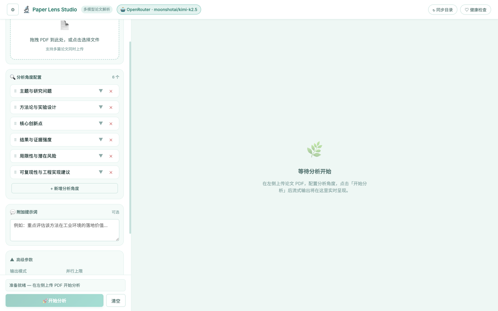

# Paper Lens Studio — React 前端使用文档

> 基于 React 18 + Vite 构建的现代化论文解析前端，小清新风格设计，支持单篇 / 多篇论文并行流式分析。

---

## 目录

- [界面预览](#界面预览)
- [快速启动](#快速启动)
- [界面布局说明](#界面布局说明)
- [使用流程](#使用流程)
- [多篇论文分析](#多篇论文分析)
- [分析角度配置](#分析角度配置)
- [高级参数](#高级参数)
- [前端项目结构](#前端项目结构)
- [开发与构建](#开发与构建)

---

## 界面预览

### 主界面

左侧为配置区域，右侧为流式输出区域，布局简洁。初始进入时右侧显示引导空态。


---

### 分析角度配置 + 高级参数

点击角度标题可展开编辑提示词；点击底部「▼ 高级参数」可展开输出模式、并行上限等参数。



---

### 模型配置（左上角浮层）

点击左上角 **⚙** 按钮弹出模型配置浮层，支持选择预置 Provider、填写 Base URL / API Key、保存多个配置并一键切换。


---

### 多篇论文并行分析输出

同时上传多篇论文时，右侧顶部出现**论文 Tab 栏**（带实时状态指示），每篇论文内部有**角度 Tab 栏**，点击可切换查看各维度的流式分析内容。


---

## 快速启动

### 前置依赖

- Node.js 18+（推荐 LTS）
- 后端服务已运行（默认 `http://127.0.0.1:43117`）

### 开发模式（热重载）

```bash
cd frontend
npm install      # 首次执行
npm run dev      # 启动开发服务器，端口 43118
```

浏览器访问：`http://localhost:43118`

> 开发服务器会自动将 `/v1/*` 和 `/health` 请求代理至后端 43117 端口，无需跨域配置。

### 生产构建

```bash
cd frontend
npm run build    # 输出至 ../web/，后端直接提供服务
```

构建产物在 `web/` 目录，可直接由 FastAPI 静态文件服务访问，地址与后端相同：`http://127.0.0.1:43117`。

---

## 界面布局说明

```
┌────────────────────────────────────────────────────────────────┐
│  ⚙  🔬 Paper Lens Studio  多模型论文解析  [Provider Badge]  ↻ ♡│ ← 顶栏
├──────────────────────┬─────────────────────────────────────────┤
│                      │  [论文1 ⟳] [论文2 ✓] [论文3 ·]         │ ← 论文 Tab（多篇时显示）
│  📂 论文上传         │ ────────────────────────────────────── │
│  ┌─────────────────┐ │  [主题] [方法] [创新] ... [📋 综合报告] │ ← 角度 Tab
│  │ 拖拽 / 点击上传  │ │ ────────────────────────────────────── │
│  └─────────────────┘ │                                         │
│                      │  # 方法论与实验设计                      │
│  🔍 分析角度配置     │                                         │
│  · 主题与研究问题    │  本文提出了 **DMCG** 框架...（流式输出）  │
│  · 方法论与实验设计  │                                         │
│  · 核心创新点        │                                         │
│  · ...              │                                         │
│  + 新增角度          │                                         │
│                      │                                         │
│  💬 附加提示词       │                                         │
│  ▼ 高级参数          │                                         │
│ ────────────────── │                                         │
│  [状态消息]          │                                         │
│  [🚀 开始分析] [清空]│                                         │
└──────────────────────┴─────────────────────────────────────────┘
```

| 区域 | 说明 |
|------|------|
| **顶栏左上角 ⚙** | 点击弹出模型配置浮层 |
| **Provider Badge** | 显示当前使用的 Provider 名称 |
| **↻ 同步目录** | 手动同步 Provider 预置目录 |
| **♡ 健康检查** | 检查后端服务状态 |
| **左侧面板** | 上传、配置、启动区域 |
| **右侧面板** | 流式输出，含论文 Tab + 角度 Tab 双层导航 |

---

## 使用流程

### 第一步：配置模型

点击左上角 **⚙** 按钮，在浮层中完成配置：

1. **选择服务商**：从预置列表（OpenAI / OpenRouter / DeepSeek / Groq 等）选择
2. **选择推荐模型**：下拉自动填充该服务商的推荐模型列表
3. **填写连接信息**：Base URL 自动填充，手动填写 API Key
4. **保存配置**：点击「保存配置」，可保存多套配置
5. **切换配置**：在「已保存配置」中选中目标配置，点击「使用此配置」
6. **验证连通性**（可选）：点击「连通性检查」验证 API 可用性

### 第二步：上传论文

在左侧「论文上传」区域：
- **拖拽** PDF 文件到虚线框内
- 或**点击**选择文件（支持多选，实现批量分析）

### 第三步：配置分析角度

展开「分析角度配置」中的各项，修改：
- **角度标题**：点击标题直接编辑
- **提示词**：点击 ▼ 展开后在文本框中输入该角度的分析重点

默认包含 6 个内置角度，支持新增（最多 8 个）或删除。

### 第四步：开始分析

点击底部 **🚀 开始分析** 按钮，右侧面板立即开始流式展示分析结果。

---

## 多篇论文分析

上传多个 PDF 后，系统会对所有论文**并行发起 SSE 流式请求**，同时分析。

### 右侧输出区域导航

**论文 Tab 栏**（顶部，多篇时显示）：

| 状态图标 | 含义 |
|---------|------|
| `⟳` 旋转 | 该论文正在分析中 |
| `✓` 绿色 | 分析已完成 |
| `✕` 红色 | 分析出错 |
| `·` 灰色 | 等待开始 |

**角度 Tab 栏**（Paper Tab 下方）：

| 状态点 | 含义 |
|-------|------|
| 🟢 绿点 | 该角度已完成 |
| 🔵 闪烁蓝点 | 正在流式生成中 |
| 🔴 红点 | 生成出错 |
| ○ 空点 | 尚未开始 |

点击不同的**论文 Tab** 切换查看对象；在选中论文内点击**角度 Tab** 切换查看维度；最右侧「📋 综合报告」Tab 显示所有角度完成后的融合报告。

---

## 分析角度配置

每个角度由两部分组成：

| 字段 | 说明 |
|------|------|
| **角度标题** | 显示在 Tab 上的名称，简明扼要 |
| **角度提示词** | 告知大模型该维度的具体分析侧重点 |

**默认 6 个内置角度：**

1. 主题与研究问题
2. 方法论与实验设计
3. 核心创新点
4. 结果与证据强度
5. 局限性与潜在风险
6. 可复现性与工程实现建议

角度配置会**自动保存到 localStorage**，下次打开时恢复。

---

## 高级参数

点击左侧「▼ 高级参数」展开：

| 参数 | 默认值 | 说明 |
|------|--------|------|
| **输出模式** | 逐角度流式 | `sequential`：角度顺序输出；`parallel`：多角度并行 |
| **并行上限** | 3 | 并行流式时最大同时运行的角度数（1-8） |
| **最大提取字数** | 30000 | PDF 提取文字的字符上限（2000-30000） |
| **深度思考模式** | 关闭 | 开启后使用 Reasoning 模型，会在分析前显示思考过程 |

---

## 前端项目结构

```
frontend/
├── index.html               # 入口 HTML
├── vite.config.js           # Vite 配置（构建输出至 ../web/，代理 API）
├── package.json
└── src/
    ├── main.jsx             # React 应用入口
    ├── App.jsx              # 根组件：持有所有状态 + 流式逻辑
    ├── styles.css           # 全局样式（Design Tokens + 组件样式）
    ├── components/
    │   ├── Header.jsx       # 顶栏：⚙ 按钮、Logo、Provider 徽章、操作按钮
    │   ├── SettingsDrawer.jsx  # 模型配置浮层（左上角弹出）
    │   ├── LeftPanel.jsx    # 左侧面板：上传 + 角度配置 + 附加提示词 + 启动
    │   ├── RightPanel.jsx   # 右侧面板容器
    │   ├── OutputArea.jsx   # 输出区：论文 Tab + 角度 Tab + 流式内容
    │   ├── UploadZone.jsx   # 拖拽上传区域
    │   └── AngleConfigList.jsx  # 可折叠角度列表编辑器
    └── utils/
        ├── api.js           # fetch 封装（get/post/delete）
        └── markdown.js      # marked + DOMPurify 渲染 + 脏词清理
```

### 状态管理设计

- **React 状态**：providers、papers 元数据（标题、状态、角度进度）
- **Ref（contentMap）**：流式文本内容，key 格式 `${paperId}:${angleName}`，避免每次 chunk 触发全量渲染
- **RAF 节流渲染**：通过 `requestAnimationFrame` 限制 re-render 频率，保证流式输出性能

---

## 开发与构建

```bash
# 安装依赖
cd frontend && npm install

# 开发模式（热重载，端口 43118）
npm run dev

# 生产构建（输出至 web/）
npm run build

# 预览生产构建
npm run preview
```

### 依赖版本

| 包 | 版本 | 用途 |
|----|------|------|
| react | ^18.3 | 核心框架 |
| vite | ^5.4 | 构建工具 |
| @vitejs/plugin-react | ^4.3 | React 插件 |
| marked | ^12.0 | Markdown 渲染 |
| dompurify | ^3.2 | HTML 安全净化 |

---

## 设计规范

### 色彩系统（小清新）

| Token | 色值 | 用途 |
|-------|------|------|
| `--brand` | `#3d9e8c` | 主色调（薄荷绿） |
| `--bg-page` | `#eef7f4` | 页面背景 |
| `--bg-surface` | `#ffffff` | 卡片/面板背景 |
| `--text` | `#2b3f3d` | 主文字 |
| `--border` | `#c5e0db` | 边框 |
| `--success` | `#5aab70` | 成功绿 |
| `--error` | `#c95c5c` | 错误红 |

### 字体

- 英文 / 数字：**Inter**（Variable，系统优先）
- 中文：**Noto Sans SC**（Google Fonts CDN）
